# Enemies

| Enemy Type | Name                                                                                 |
|------------|--------------------------------------------------------------------------------------|
| 00         | [Weapon Item](#00---weapon-item)                                                     |
| 01         | [Flying Capsule](#01---flying-capsule)                                               |
| 02         | [Bullet](#02---bullet)                                                               |
| 03         | [Soldier](#03---soldier)                                                             |
| 04         | [Pill Box Sensor](#04---pill-box-sensor)                                             |
| 05         | [Grenade Thrower](#05---grenade-thrower)                                             |
| 06         | [Grenade](#06---grenade)                                                             |
| 07         | [Sandbag Sniper](#07---sandbag-sniper)                                               |
| 09         | [Sniper](#09---sniper)                                                               |
| 0a         | [Rotating Gun](#0a---rotating-gun)                                                   |
| 0b         | [Gray Turret](#0b---gray-turret)                                                     |
| 0c         | [Enemy Explosion Animation](#0c---enemy-explosion-animation)                         |
| 0d         | [Door](#0d---door)                                                                   |
| 0e         | [Overhead Level Bullet](#0e---overhead-level-bullet)                                 |
| 0f         | [Grenade Generator](#0f---grenade-generator)                                         |
| 10         | [Soldier Generator](#10---soldier-generator)                                         |
| 20         | [Wall Cannon](#20---wall-cannon)                                                     |
| 21         | [Helicopter Core](#21---helicopter-core)                                             |
| 22         | [Helicopter Turret](#22---helicopter-turret)                                         |
| 23         | [Helicopter Bay](#23---helicopter-bay)                                               |
| 24         | [Alien Ladybug](#24---alien-ladybug)                                                 |
| 25         | [Rack-Mounted Turret](#25---rack-mounted-turret)                                     |
| 26         | [Hiding Sniper](#26---hiding-sniper)                                                 |
| 27         | [Raised Grass-Covered Turret](#27---raised-grass-covered-turret)                     |
| 28         | [Cannon Turret](#28---cannon-turret)                                                 |
| 29         | [Mortar Round](#29---mortar-round)                                                   |
| 2a         | [Red Bubble](#2a---red-bubble)                                                       |
| 2b         | [Boss Red Poisonous Insect Gel](#2b---boss-red-poisonous-insect-gel)                 |
| 2c         | [Collapsible Ceiling](#2c---collapsible-ceiling)                                     |
| 2d         | [Falling Ceiling Tile](#2d---falling-ceiling-tile)                                   |
| 2e         | [Overhead Tank Soldier](#2e---overhead-tank-soldier)                                 |
| 2f         | [Falling Rock](#2f---falling-rock)                                                   |
| 30         | [Overhead Tank Soldier Bullet](#30---overhead-tank-soldier-bullet)                   |
| 31         | [Spinning Bubbles](#31---spinning-bubbles)                                           |
| 32         | [Raised Metal-Covered Turret](#32---raised-metal-covered-turret)                     |
| 33         | [Turret Metal Bullet](#33---turret-metal-bullet)                                     |
| 34         | [Jet Pack Soldier](#34---jet-pack-soldier)                                           |
| 35         | [Red Poisonous Insect Gel](#35---red-poisonous-insect-gel)                           |
| 36         | [Tank Boss Electrode](#36---tank-boss-electrode)                                     |
| 37         | [Blue Poisonous Insect Gel](#37---blue-poisonous-insect-gel)                         |
| 38         | [Unknown](#38---unknown)                                                             |
| 39         | [Elevator](#39---elevator)                                                           |
| 3a         | [Robot Spider Bullet](#3a---robot-spider-bullet)                                     |
| 3b         | [Manooki](#3b---manooki)                                                             |
| 3c         | [Manooki Projectile](#3c---manooki-projectile)                                       |
| 3d         | [Eggron](#3d---eggron)                                                               |
| 3e         | [Bugger](#3e---bugger)                                                               |
| 3f         | [Earthquake](#3f---earthquake)                                                       |
| 40         | [Winged Soldier](#40---winged-soldier)                                               |
| 41         | [Winged Soldier Generator](#41---winged-soldier-generator)                           |
| 42         | [Laser Chandelier](#42---laser-chandelier)                                           |
| 43         | [Chandelier Arm](#43---chandelier-arm)                                               |
| 44         | [Chandelier Arm Laser](#44---chandelier-arm-laser)                                   |
| 45         | [Wadder](#45---wadder)                                                               |
| 46         | [Red Poisonous Insect Gel](#46---red-poisonous-insect-gel)                           |
| 47         | [Jameera](#47---jameera)                                                             |
| 48         | [Jameera Projectile](#48---jameera-projectile)                                       |
| 49         | [Stomping Ceiling](#49---stomping-ceiling)                                           |
| 4b         | [Fortress Wall Core](#4b---fortress-wall-core)                                       |
| 4e         | [Robot Spider](#4e---robot-spider)                                                   |
| 50         | [Fortress Wall Turret](#50---fortress-wall-turret)                                   |
| 51         | [Temple of Terror Skull](#51---temple-of-terror-skull)                               |
| 52         | [Temple of Terror Core](#52---temple-of-terror-core)                                 |
| 53         | [Temple of Terror Acid Drop Generator](#53---temple-of-terror-acid-drop-generator)   |
| 54         | [Temple of Terror Core](#54---temple-of-terror-core)                                 |
| 55         | [Temple of Terror Poisonous Insect Gel](#55---temple-of-terror-poisonous-insect-gel) |
| 56         | [Temple of Terror Poison Drop](#56---temple-of-terror-poison-drop)                   |
| 58         | [Storage Room Soldier Generator](#58---storage-room-soldier-generator)               |
| 59         | [Krypto-Crustacean](#59---krypto-crustacean)                                         |
| 5a         | [Alien Skull](#5a---alien-skull)                                                     |
| 5b         | [Rotating Turret](#5b---rotating-turret)                                             |
| 5c         | [Stationary Red Soldier](#5c---stationary-red-soldier)                               |
| 5d         | [Mouth Pit](#5d---mouth-pit)                                                         |
| 5e         | [Mouth Pit Generator](#5e---mouth-pit-generator)                                     |
| 5f         | [Big Faced One-Eyed Monster](#5f---big-faced-one-eyed-monster)                       |
| 60         | [Baby Alien Ladybug](#60---baby-alien-ladybug)                                       |
| 61         | [Boss Screen Baby Alien Ladybug](#61---boss-screen-baby-alien-ladybug)               |
| 62         | [Intro Helicopter](#62---intro-helicopter)                                           |
| 63         | [Overhead Soldier](#63---overhead-soldier)                                           |
| 64         | [Suspicious Face](#64---suspicious-face)                                             |
| 65         | [Jagger Froid](#65---jagger-froid)                                                   |
| 66         | [Alien Serpent](#66---alien-serpent)                                                 |
| 68         | [Jagger Froid Projectile](#68---jagger-froid-projectile)                             |
| 69         | [Tank Boss](#69---tank-boss)                                                         |
| 6a         | [Tank Gunner](#6a---tank-gunner)                                                     |
| 6b         | [Bubbles](#6b---bubbles)                                                             |
| 6c         | [Ceiling Vent](#6c---ceiling-vent)                                                   |
| 6d         | [Kimkoh](#6d---kimkoh)                                                               |
| 6e         | [Falling Rubble](#6e---falling-rubble)                                               |
| 6f         | [Background Storm](#6f---background-storm)                                           |
| 70         | [Suspicious Face Arm](#70---suspicious-face-arm)                                     |
| 71         | [Area 6 Tile Swapper](#71---area-6-tile-swapper)                                     |

## ENEMY_DIFFICULTY

Many enemies' health is based on the `ENEMY_DIFFICULTY` variable, which is
either 0, 1, or 2.  This value is determined by the number of players who have
the S weapon.

!(TODO) There is some code that sets this to 4, but I don't know when it executes.

## Shared Enemy Attributes

Many enemies have their bit 2 set when alive, and clear when destroyed (see
`strip_alive_attr_remove_enemy`).  Many enemies have their bit 1 set when
destroyed (see `enemy_explosion_routine_00`/`bg_enemy_explosion_routine_00`)

### 00 - Weapon Item

Gives the player various power-ups/weapons upgrades.  It is a letter
representing the weapon type surrounded by wings.

* Rapid Fire (R) - 
* Machine Gun (M) - 
* Flame Thrower (F) - 
* Spray Gun (S) - 
* Laser (L) - 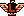
* Barrier (B) - 
* Falcon - 

#### Attributes

```
 7  bit  0
 7654 3210
      ||||
      ++++- weapon type (see list below)
```

* Weapon Type
  * `0000` - Machine Gun (M)
  * `0001` - Spray Gun/Spread Gun (S)
  * `0010` - Laser (L)
  * `0011` - Flame Thrower/Fire Gun/Fire Ball (F)
  * `0100` - Rapid Fire (R)
  * `0101` - Invincibility/Barrier (B)
  * `0110` - Falcon

#### Variables

* `ENEMY_VAR_6` - vertical screen indicator.  Used to prevent background
  collision checking when offscreen vertically.
  * #$ff above visible screen
  * #$00 visible screen
  * #$01 below visible screen

### 01 - Flying Capsule

Other Names: Weapon Zeppelin, Power-Up Capsule, Weapon Wings, Weapon Drop,
  Flying Item Pod, or Football

Weapon Item transportation device that which travels from the left end of the
screen to the other in a wave-like pattern.

#### Attributes

```
 7  bit  0
 7654 3210
   ++------ capsule initial position and velocity
            * 00 - initial pos = (-08,  80) x vel = -2, y vel = -2
            * 01 - initial pos = (  8,   0) x vel =  2, y vel = -2
            * 10 - initial pos = (  0, 208) x vel =  2, y vel = -2 (vertical)
            * 11 - initial pos = (  8,  48) x vel =  2, y vel = -2
```

#### Variables

* `ENEMY_VAR_2` - X position accounting for X scroll
* `ENEMY_VAR_1` - Y position accounting for vertical scroll

### 02 - Bullet

Used for both regular red bullets and silver metal bullets.  First a muzzle
flash is shown, and then the actual bullet sprite is used.  Much of this logic
is shared between regular enemy bullets,
[Overhead Level Bullet](#0e---overhead-level-bullet), and the
[Overhead Tank Soldier Bullet](#30---overhead-tank-soldier-bullet) fired by the
[Overhead Tank Soldier](#20---overhead-tank-soldier)


There are no attributes for this enemy type.

#### Variables

* `ENEMY_VAR_1` - bullet type, references `enemy_bullet_sprite_tbl`
  * #$00 - default red bullet
  * #$01 - silver metal bullet
  * #$02 - silver metal bullet (tank bullets)
* `ENEMY_FIRING_DELAY` - for overhead tank soldier, and overhead soldier, specifies
  delay before bullet is destroyed
* `ENEMY_DELAY` - used for flashing palette effect

### 03 - Soldier

Other Names: Running Man, Orian, Humanoid Alien, Greeder, Mutated Greeder

Same enemy type for both soldiers and humanoid aliens.  Used for outdoor levels.
For overhead soldiers, see [Overhead Soldier](#63---overhead-soldier).  On level
4 (Inner Base), soldier can be red and pause between following player to fire at
them.

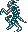

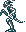
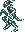
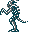
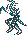

#### Attributes

```
 7  bit  0
 7654 3210
 || | ||||
 || | |||+- 0 = walking left, 1 = walking right
 || | ||+-- 1 = fire, 0 = do not fire
 || + +---- soldier palette override (see soldier_sprite_attr_tbl)
 ||         when zero, use palette as defined by level
 ||         when non-zero soldier will fire
 |+-------- in probotector, set for Level 7 soldier
 +--------- set to be orian (alien), clear for regular soldier
```

#### Variables

* `ENEMY_VAR_3` - which sprite animation to run, see
  `set_enemy_animation_sprite`
* `ENEMY_VAR_1` - #$80 when jumping
* `ENEMY_VAR_4` - soldier palette override, when zero palette is defined for the
  level (see soldier_sprite_attr_tbl). When non-zero soldier fires.
  (!UNUSED) there is logic for soldiers to crouch when firing based on
  ENEMY_VAR_4, but this wasn't used.  If you force this behavior, the soldier
  uses sprite `sprite_22`.
* `ENEMY_VAR_6` - whether or not the soldier is off-screen
* `ENEMY_VAR_2` - number of background collisions before automatically
  destroying the soldier.  Initialized to 3.
* `ENEMY_FIRING_DELAY` - for soldier that fire at player (level 4), this value controls
  timer for the soldier to stop/pause before firing
* `ENEMY_DELAY` - for soldiers that fire at player (level 4), this value
  specifies the time to chase player before pausing to fire
* `ENEMY_VAR_5` - for soldiers that fire, this this used to time the recoil
  effect
* `ENEMY_ANIMATION_DELAY` - animation delay

### 04 - Pill Box Sensor

Other Names: Weapon Box

Repeatedly opens and closes.  Vulnerable only when fully open. Creates
[Weapon Item](#00---weapon-item) when destroyed.

#### Attributes

```
 7  bit  0
 7654 3210
    | ||||
    | ++++- weapon item type to create when destroyed (see list below)
    +------ Y position adjustment
            1 = add #$14, 0 = add #$04
```

* Weapon Type
  * `0000` - Machine Gun (M)
  * `0001` - Spray Gun/Spread Gun (S)
  * `0010` - Laser (L)
  * `0011` - Flame Thrower/Fire Gun/Fire Ball (F)
  * `0100` - Rapid Fire (R)
  * `0101` - Invincibility/Barrier (B)
  * `0110` - Falcon

#### Variables

* `ENEMY_VAR_1` - 1 = fully open (vulnerable), 0 = closed (invulnerable)
* `ENEMY_DELAY` - delay until next animation frame change

### 05 - Grenade Thrower

Soldier that throws grenades at the closest player. The soldier will throw a few
grenades quickly, then have a longer delay before throwing the next round of
grenades.

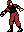
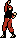

#### Attribute

```
 7  bit  0
 7654 3210
      || |
      || +- meant to allow using different sprites for enemy, but regardless of
      ||    value being 0 or 1, sprite #$27 (sprite_27) is always used
      ++--- number of grenades to throw in a row
```

#### Variables

* `ENEMY_VAR_1` - number of grenades to throw in a row
* `ENEMY_VAR_2` - current number of grenades to throw in a row
* `ENEMY_FIRING_DELAY` - delay between throwing grenades
* `ENEMY_VAR_5` - recoil effect timer

### 06 - Grenade

Other Names: Gapsa

Grenade that falls and explodes when it hits the ground.  When collides with
player will kill player but not explode until it hits the ground.


#### Attributes

```
 7  bit  0
 7654 3210
 |      ||
 |      ++- grenade type - specifies grenade velocity and sprite attribute
 +--------- 1 = fall to the left, 0 = fall to the right
```

There are 4 different grenade types

0. Unused?
    * initial Y velocity = -4, initial X velocity = +/-1
    * no background priority
    * initially skip player grenade collision detection until begins falling
1. Grenade thrown by [Grenade Thrower](#05---grenade-thrower)
    * initial Y velocity = -1, initial X velocity = +/-1.25
    * no background priority
2. Grenade generated by [Grenade Generator](#0f---grenade-generator)
    * initial Y velocity = -3, initial X velocity = +/-.25
    * background priority
3. Unused?
    * initial Y velocity = -1, initial X velocity = +/-.25
    * no background priority

### 07 - Sandbag Sniper

Other Names: Sandbag Soldier, Crouching Sniper

A sniper crouched behind a sandbag. After an initial delay of #$67 frames, the
sniper shoots two bullets at a time with a #$80-frame delay between firing.  The
bullets have a velocity of -1.75 pixels per frame and are fired with a
#$0a-frame delay between the first and second bullet.

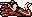

**ENEMY HP**: #$05, #$09, or #$0d

There are no attributes for this enemy type.

#### Variables

* `ENEMY_VAR_2` - Used to keep track of which bullet is being fired to know the
delay before firing the next bullet.
* `ENEMY_VAR_5` - Used to time firing recoil

### 09 - Sniper

Fires two bullets at a time towards the closest player.  With a delay of #$60
between attacks and a delay of #$0c between the bullets for the attack.


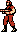
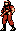

#### Attributes

```
 7  bit  0
 7654 3210
   |    ||
   |    ++- longer delay between firing at player
   +------- sniper sprite background priority
```

#### Variables

* `ENEMY_VAR_3` - longer delay value between firing at player
* `ENEMY_VAR_4` - one more than the number of bullets to fire per attack, e.g.
  a value of 3 fires 2 bullets per attack.
* `ENEMY_FIRING_DELAY` - delay until next bullet is fired
* `ENEMY_VAR_5` - sniper fired recoil timer

### 0a - Rotating Gun

Level 4 (Inner Base) elevator area and Level 5 (The Cliff) rotating gun.

**ENEMY HP**: #$07, #$0b, or #$0e

#### Attributes

```
 7  bit  0
 7654 3210
    | | ||
    | | ++- number of bullets to fire per attack
    | +---- whether or not there is an activation animation
    |       1 = activation animation (level 5 the cliff)
    |       0 = no activation animation (level 4 inner base)
    +------ y location removal bit
            1 = (early removal) remove when gun in bottom 62.5% of screen
            0 = (later removal) remove when gun in bottom 84% of screen
```

#### Variables

* `ENEMY_VAR_3` - number of bullets to fire per attack
* `ENEMY_VAR_4` - remaining number of bullets to fire per attack
* `ENEMY_FIRING_DELAY` - delay until next bullet is fired
* `ENEMY_DELAY`
  * for level 5 rotating turrets, used to time activation animation
  * once active, delay until re-aim at player
* `ENEMY_VAR_1`
  * aiming direction to increment or decrement when targeting player
  * offset index for created bullets to adjust initial position

### 0b - Gray Turret

Other Names: Grey Turret

After activating, targets the closest player (along y axis) every #$15 frames.

**ENEMY HP**: #$08, #$0c, or #$0f

#### Attributes

```
 7  bit  0
 7654 3210
       |||
       ||+- facing direction (0 = right, 1 = left)
       ++-- number of bullets to fire per attack
```

#### Variables

* `ENEMY_VAR_3` - number of bullets to fire per attack
* `ENEMY_VAR_4` - remaining number of bullets to fire per attack
* `ENEMY_FIRING_DELAY` - delay until next bullet is fired
* `ENEMY_DELAY`
  * used to time animation of activation
  * once active, delay until re-aim at player
* `ENEMY_VAR_1` - aiming direction, starts at 0 meaning 3 o'clock and increases
  clockwise.  Has 12 divisions just like a clock as well. Ends at 2 o'clock when
  aim direction is #$0b (11).

### 0c - Enemy Explosion Animation

I don't believe this enemy is ever used by itself, but rather as part of the
destruction explosion animation for many enemies.  Plays the appropriate enemy
destroyed sound based on bits 2345 of `ENEMY_DESTROY_ATTRS`.  Then animates a
single explosion, either circular or spiked based on bit 1 of
`ENEMY_DESTROY_ATTRS`.

* Spiked Explosion
  * 
  * 
  * 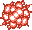
  * 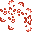
* Circular Explosion
  * 
  * 
  * 

### 0d - Door

Door that must be destroyed before advancing in overhead levels.  Appears before
level 2 (Base Area 2) boss and level 6 (Entry to HQ) boss.

**ENEMY HP**: #$10

#### Attributes

```
 7  bit  0
 7654 3210
         |
         +- which level 0 = level 2, 1 = level 6
```

#### Variables

* `ENEMY_VAR_1` - used to keep track of which supertile to update during
  destruction
* `ENEMY_VAR_4` - once destroyed, counts the number of remaining explosions for
  the destruction animation

### 0e - Overhead Level Bullet

Regular bullets fired in the overhead levels.  First a muzzle flash is shown,
and then the actual bullet sprite is used.  Much of this logic is shared between
regular [Bullet](#02---bullet), and the
[Overhead Tank Soldier Bullet](#30---overhead-tank-soldier-bullet) fired by the
[Overhead Tank Soldier](#20---overhead-tank-soldier).


There are no attributes for this enemy type.

#### Variables

* `ENEMY_VAR_1` - bullet type, references `enemy_bullet_sprite_tbl`
  * #$00 - default red bullet
  * #$01 - silver metal bullet
  * #$02 - silver metal bullet (tank bullets)
* `ENEMY_FIRING_DELAY` - for overhead tank soldier, and overhead soldier, specifies
  delay before bullet is destroyed
* `ENEMY_DELAY` - used for flashing palette effect

### 0f - Grenade Generator

Invisible enemy that launches one or more [grenades](#06---grenade) per attack.
Each grenade has a delay of #$18 frames. After an attack, there is a delay of
#$63 frames.

#### Attributes

```
 7  bit  0
 7654 3210
   |    ++- number of grenades to launch per attack
   +------- generated grenade fall direction
            1 = fall to the left, 0 = fall to the right
```

#### Variables

* `ENEMY_VAR_1` - one less than the number of grenades to launch every round of
  attacks.  For example, #$00 would launch 1 grenade per attack.
* `ENEMY_VAR_2` - one less than the remaining number of grenades to launch in
  current attack round.  For example, #$02 would mean there are 3 grenades
  remaining to launch in current attack.

### 10 - Soldier Generator

Invisible enemy that generates soldiers. Does not generate a soldier if the 
closest player is within #$18 horizontal pixels of the soldier generator.

#### Attributes

```
 7  bit  0
 7654 3210
   |
   +------- generated soldier background priority
```

#### Variables

* `ENEMY_VAR_1` - one less than the remaining number of soldiers to generate in
the current round of soldier generation.  For example, #$01 would mean there are
2 soldiers to generate.
* `ENEMY_DELAY` - delay until next soldier is generated

### 20 - Wall Cannon

Other Names: Armored Turret, Ground Cannon, Gulcan

Level 1 (Fort Firestorm) cannon that pops up from the ground and can fire a
[Bullet](#02---bullet), one at a time.  Some cannons do not fire bullets and are
just a wall (even though they still have the gun)

**ENEMY HP**: #$0c, #$10, or #$13

#### Attributes

```
 7  bit  0
 7654 3210
         |
         +- firing suppression flag (1 = don't fire bullets, 0 = fire bullets)
           if beat the game, this flag is ignored
```

#### Variables

* `ENEMY_FRAME` - references `wall_cannon_1st_supertile_tbl` and
  `wall_cannon_2nd_supertile_tbl`
  * #$00 - half-risen
  * #$01 - fully risen
  * #$02 - destroyed/removed
* `ENEMY_DELAY` - used to time animation of rising from ground and also used to
  time firing attacks
* `ENEMY_VAR_4` - once destroyed, counts the number of remaining explosions for
  the destruction animation

### 21 - Helicopter Core

Main target of Level 1 (Fort Firestorm) boss helicopter. Contains logic for
manipulating the path of the helicopter.  Follows a 10 step flight plan, then
repeatedly moves left and right, up and down until hits edge, then reverses
direction (think bouncing DVD Video logo pattern).


**ENEMY HP**: #$20, #$30, or #$38

#### Variables

* `ENEMY_VAR_1`
  * helicopter core mode, controls how core behaves (see
  `run_helicopter_core_subroutine`)
  * used to set velocity (see `set_helicopter_velocity`)
* `ENEMY_VAR_2`
  * PPU address low byte
* `ENEMY_VAR_4`
  * counter for number of blank rows to draw to nametable
  * once destroyed, counts the number of remaining explosions for the
    destruction animation
* `ENEMY_VAR_7`
  * horizontal screen indicator (#$ff left of visible screen, #$00 visible
    screen, #$01 right of visible screen)
  * number of off-screen turrets (x-axis), used to prevent opening
    [Helicopter Bay](#23---helicopter-bay) when any turret is off-screen.  This
    is also used when core is destroyed off screen to still show explosions.
* `ENEMY_VAR_6` - number of off-screen turrets (y-axis), used to prevent opening
  [Helicopter Bay](#23---helicopter-bay) when any turret is off-screen.
* `ENEMY_VAR_3` - incremented when [Helicopter Bay](#23---helicopter-bay) is
  created
* `ENEMY_VAR_5` - delay for door closings (0 = )
* `ENEMY_FRAME` - which frame of the helicopter to draw. #$00 to #$05

### 22 - Helicopter Turret

One of four turrets on the Level 1 boss helicopter.

**ENEMY HP**: #$08, #$0c, or #$0f

#### Attributes

```
 7  bit  0
 7654 3210
        ||
        ++- turret number (#$00, #$01, #$02, or #$03)
```

#### Variables

* `ENEMY_VAR_5` - enemy slot index of [Helicopter Core](#21---helicopter-core)
* `ENEMY_VAR_7` - horizontal screen indicator
  * #$ff left of visible screen
  * #$00 visible screen
  * #$01 right of visible screen
* `ENEMY_VAR_6` - vertical screen indicator
  * #$ff above visible screen
  * #$00 visible screen
  * #$01 below visible screen
* `ENEMY_VAR_3` - remaining number of bullets to fire per attack
* `ENEMY_VAR_1` - calculated targeting direction, used to calculate a more
  limited aim direction of 0 = right, 1 = straight, or 2 = left
* `ENEMY_FIRING_DELAY` - bullet fire delay timer
* `ENEMY_VAR_4`
  * player index of currently targeted player (0 = p1, 1 = p2)
  * once destroyed, counts the number of remaining explosions for the
    destruction animation
* `ENEMY_DELAY` - delay until re-target player

### 23 - Helicopter Bay

Back at the back of the Level 1 boss helicopter that generates soldiers.  The
bay is not harmed by bullets and destroyed when the
[Helicopter Core](#21---helicopter-core) is destroyed.

#### Attributes

```
 7  bit  0
 7654 3210
        ||
        ++- helicopter bay number (always #$04)
```

#### Variables

* `ENEMY_VAR_5` - enemy slot index of [Helicopter Core](#21---helicopter-core)
* `ENEMY_VAR_7` - horizontal screen indicator
  * #$ff left of visible screen
  * #$00 visible screen
  * #$01 right of visible screen
* `ENEMY_VAR_6` - whether off screen vertically
* `ENEMY_VAR_1` - counts up to #$06 to track number of soldiers generated to
  know when to generate red firing soldier. Resets after #$06 to start counting
  again
* `ENEMY_VAR_2` - indicates duration to keep bay door open
  * #$00 - (longer) open bay and generate soldiers for #$b0*4=#$2c0 frames
  * #$01 - (shorter) open bay and generate soldiers for #$a0*4=#$280 frames
* `ENEMY_FIRING_DELAY` - delay between each soldier generation, starts at #$20
* `ENEMY_DELAY` - used to time opening and closing
* `ENEMY_FRAME` - references `helicopter_bay_frame_ptr_tbl`
  * #$00 - fully closed
  * #$01 - partially open
  * #$02 - mostly open
  * #$03 - fully open

### 24 - Alien Ladybug

Other Names: Dumpling, Dumpling Bug Alien, Dumpling Mushroom Alien, Alien
Ladybirds.

See Also: [Baby Alien Ladybug](#60---baby-alien-ladybug) and
[Boss Screen Baby Alien Ladybug](#61---boss-screen-baby-alien-ladybug)

Alien ladybug that appears on level 6 (Entry to HQ). Some can fire at player.


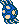
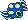
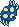
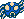


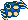
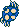
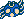


#### Attributes

```
 7  bit  0
 7654 3210
        ||
        |+-
        +-- whether or not the alien ladybug fires at the player
```

#### Variables

* `ENEMY_VAR_4`
  * bit 0 - player to target (0 = p1, 1 = p2)
  * bit 6 - whether or not to change target to new random target at bottom of
    screen
  * bit 7 - 1 = random target at bottom of screen, 0 = target player specified
    in bit 0
* `ENEMY_VAR_1` - aim direction
* `ENEMY_VAR_2` - overhead aim direction.  Indexes into `alien_ladybug_vel_tbl`
  * #$00 - crawl right
  * #$01 - crawl down right
  * #$02 - crawl down
  * #$03 - crawl down left
  * #$04 - crawl left
  * #$05 - crawl left up
  * #$06 - crawl up
  * #$07 - crawl up right
* `ENEMY_VAR_3` - direction ladybug was traveling when encountered bg collision
  * #$01 - moving right
  * #$02 - moving left
  * #$03 - moving down
  * #$04 - moving up
* `ENEMY_FIRING_DELAY` - projectile fire delay timer
* `ENEMY_DELAY` - delay until re-target player
* `ENEMY_ANIMATION_DELAY` - delay for animating crawl
* `ENEMY_FRAME` - used to animate ladybug crawl, alternates between #$00 and
  #$01.  References `alien_ladybug_sprite_tbl`
* `ENEMY_VAR_5` - ?? not sure, set to #$06 after firing

### 25 - Rack-Mounted Turret

Other Names: Rack Turret

Travels left and right along a rack firing at closest player.

**ENEMY HP**: #$04, #$08, or #$0b


#### Attributes

```
 7  bit  0
 7654 3210
         |
         +- initial X velocity
            0 = -0.5
            1 = 0.5
```

#### Variables

* `ENEMY_VAR_1` - X velocity index
  * 0 = -0.5
  * 1 = 0.5
* `ENEMY_FIRING_DELAY` - delay until next bullet is fired
* `ENEMY_VAR_3` - player index of player to target (0 = p1, 1 = p2)
* `ENEMY_VAR_2` - sprite and sprite attribute index
  * #$00 - sprite_64
  * #$01 - sprite_65
  * #$02 - sprite_64 (flipped horizontally)

### 26 - Hiding Sniper

Other Names: Crouching Sniper

Sniper that crouches for a bit, stands to fire a single shot, waits #$30 frames,
then crouches back down for #$60 frames.  This is then repeated.

Note this is not the sniper in the trees.  That is [Sniper](#09---sniper).  This
sniper is on the ground.


There are no attributes for this enemy type.

#### Variables

* `ENEMY_DELAY` - used to time crouching animation
* `ENEMY_FRAME` - animation frame index, indexes into
  `crouching_sniper_sprite_tbl`

### 27 - Raised Grass-Covered Turret

Other Names: Underground Turret, Grassy Knoll, Turf Turret, Underground Gun

Compare to [Raised Metal-Covered Turret](#32---raised-metal-covered-turret).  A
turret that rises from the ground in Level 3 (Jungle).  Activates once the enemy
is scrolled left to position #$d8 (~85% of the screen).  Only rises to a low
height requiring player to crouch to destroy.

After activation, fires bullets delayed by #$04 frames.  This stream of bullets
is repeated every #$80 frames.

**ENEMY HP**: #$08, #$0c, or #$0f

#### Attributes

```
 7  bit  0
 7654 3210
       ||
       ++- one less than number of bullets to fire per attack (always #$01)
```

Bit 0 was probably reserved for facing direction like for
[Raised Metal-Covered Turret](#32---raised-metal-covered-turret), but that bit
is never read and grass-covered turrets always face left.

#### Variables

* `ENEMY_FRAME` - used when activating and firing
  * activating
    * #$00 - barely visible
    * #$01 - fully visible
    * #$02 - locked into position (frame #$00 shifted slightly left)
    * #$03 - destroyed
  * firing alternates between #$01 and #$02 to create recoil effect
* `ENEMY_DELAY`
  * delay used during animation of activation
  * delay until next bullet is fired
* `ENEMY_VAR_1` - one less than the number of [Bullets](#02---bullet) to fire
  per attack.  Used to reset after firing all bullets for next round of attack.
* `ENEMY_VAR_2` - one less than the number of bullets to fire for current round
  of attack

### 28 - Cannon Turret

Other Names: Ground Turret, Ground Mortar

Level 3 (Jungle) enemy that fires [Mortar Rounds](#29---mortar-round).  When
active, no soldiers will be generated.

**ENEMY HP**: #$20, #$24, or #$27

#### Variables

* `ENEMY_VAR_1` - number of [Mortar Rounds](#29---mortar-round) to fire per
  attack.
* `ENEMY_DELAY` - delay before firing next [Mortar Round](#29---mortar-round)
* `ENEMY_VAR_4` - once destroyed, counts the number of remaining explosions for
  the destruction animation

### 29 - Mortar Round

Level 3 enemy that is fired by the [Cannon Turret](#28---cannon-turret).
Game tries to play a sound after reaching apex of arc, but that sound has no
audio, so no sound is played.

**ENEMY HP**: #$02


There are no attributes for this enemy type.

#### Variables

* `ENEMY_VAR_1` - set by [Cannon Turret](#28---cannon-turret) when created,
  specifies initial velocity of the mortar round. Indexes into
  `mortar_round_vel_tbl`

### 2a - Red Bubble

Red bubble on the last level that floats and targets the closest player.  During
the [Stomping Ceiling](#49---stomping-ceiling) portion of the last level, the
red bubbles will delay for #$20 frames while flashing before attacking.


#### Attributes

```
 7  bit  0
 7654 3210
         |
         +- whether or not to skip `red_bubble_routine_01`, which creates a #$20
            frame delay where the red bubble is flashing, before moving and
            targeting the player. Set during stomping ceiling portion of last
            level
```

#### Variables

* `ENEMY_VAR_2`
* `ENEMY_VAR_1`- aiming direction to increment or decrement when targeting
  player

### 2b - Boss Red Poisonous Insect Gel

Other Names: Red Blob, Final Boss Red Blob

A red projectile on the final boss screen.  These blobs are invincible.  Bullets
cannot collide with them and player to enemy collision checking is disabled.
These blobs are set with an initial velocity and follow that until removed when
off-screen.  Generated by [Kimkoh](#6d---kimkoh).


**ENEMY HP**: Invincible

Compare to [Red Poisonous Insect Gel](#35---red-poisonous-insect-gel),
[Blue Poisonous Insect Gel](#37---blue-poisonous-insect-gel), and
[Red Poisonous Insect Gel](#46---red-poisonous-insect-gel)

#### Variables

* `ENEMY_VAR_1` - index that specifies delay before 'activating' the blob, which
  is when it becomes visible.  Indexes into
  `final_boss_red_blob_activate_delay_tbl`.

### 2c - Collapsible Ceiling

A ceiling that needs to be shot to collapse as a series of
[Falling Ceiling Tiles](#2d---falling-ceiling-tile).

There are no attributes for this enemy type.

#### Variables

* `ENEMY_X_POS` - unlike other enemies, this stores X position of the closest
  bullet to the ceiling.  Used to know which tile falls first.
* `ENEMY_VAR_1` - X position of next tile to drop on the right; #$00 indicates
  complete
* `ENEMY_VAR_2` - X position of next tile to drop on the left; #$00 indicates
  complete
* `ENEMY_VAR_3` - delay timer until next tile to the right is dropped
* `ENEMY_VAR_4` - delay timer until next tile to the left is dropped

### 2d - Falling Ceiling Tile

Other Names: Barrel

Ceiling tile on level 4 that falls after being shot at.  Created by
[Collapsible Ceiling](#2c---collapsible-ceiling).

**ENEMY HP**: #$04


There are no attributes for this enemy type.

### 2e - Overhead Tank Soldier

Other Names: Tucker, Overhead Tank

Blue soldiers that appear 3 times on the Level 2 (base area 2) on stationary
tanks.  Note that these soldiers are not part of [Tank Boss](#69---tank-boss).
Those are 2 red [Tank Gunners](#6a---tank-gunner) and the center green soldier
is a [Tank Boss](#69---tank-boss).


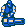

**ENEMY HP**: #$10, #$14, or #$17

#### Variables

* `ENEMY_ANIMATION_DELAY` - delay for targeting player
* `ENEMY_VAR_3` - targeted player index (0 = p1, 1 = p2)
* `ENEMY_FIRING_DELAY` - firing delay
* `ENEMY_VAR_1` - tank aim direction #$00-#$0c inclusively
  * #$00 = 3 o'clock
  * #$04 = 4:30 o'clock
  * #$06 = 6 o'clock
  * #$08 = 7:30 o'clock
  * #$0c = 9 o'clock
* `ENEMY_VAR_5` - timer for recoil effect
* `ENEMY_VAR_2` - tank aim sprite index (see `overhead_tank_soldier_sprite_tbl`)
  Can be thought of as the overhead aim direction
  * 0 = 3 o'clock
  * 1 = 5 o'clock
  * 2 = 6 o'clock
  * 3 = 7 o'clock
  * 4 = 9 o'clock
* `ENEMY_VAR_4` - once destroyed, counts the number of remaining explosions for
  the destruction animation

### 2f - Falling Rock

**ENEMY HP**: #$05, #$09, or #$0d

#### Variables

* `ENEMY_VAR_1` - background collision code

### 30 - Overhead Tank Soldier Bullet

One of a group of 3 bullets fired by the [Overhead Tank Soldier](#2e---overhead-tank-soldier).
One bullet aims left, another aims right, and 3rd bullet fires straight on.
Much of this logic is shared between [Bullet](#02---bullet), and
[Overhead Level Bullet](#0e---overhead-level-bullet).  Bullet type is #$02
(silver bullet).


#### Attributes

```
 7  bit  0
 7654 3210
        ||
        ++- bullet direction
```

bullet direction
  * #$00 - left bullet
  * #$01 - right bullet
  * #$02 - center bullet

#### Variables

* `ENEMY_VAR_1` - bullet type, references `enemy_bullet_sprite_tbl`
  * #$00 - default red bullet
  * #$01 - silver metal bullet
  * #$02 - silver metal bullet (tank bullets)
* `ENEMY_FIRING_DELAY` - for overhead tank soldier, and overhead soldier, specifies delay
  before bullet is destroyed
* `ENEMY_DELAY` - used for flashing palette effect

### 31 - Spinning Bubbles

Level 4 bubbles coming from ceiling vent.  After a #$40 frame delay, targets
closest player and accelerates to 1.75x speed to attack.

#### Variables

* `ENEMY_DELAY` - delay until target closest player
* `ENEMY_VAR_2`

### 32 - Raised Metal-Covered Turret

Other Names: Underground Turret, Underground Gun

Compare to [Raised Grass-Covered Turret](#27---raised-grass-covered-turret).
Activates once player is within #$20 pixels vertically.  After activation, fires
a [Turret Metal Bullet](#33---turret-metal-bullet) every #$50 frames.

Although programed for the ability to be configured to face right and fire to
the right, only ever fires to the left.

**ENEMY HP**: #$08, #$0c, or #$0f

#### Attributes

```
 7  bit  0
 7654 3210
         |
         +- facing direction
            0 = left, 1 = right
```

#### Variables

* `ENEMY_DELAY`
  * delay used during animation of activation
  * delay until next bullet is fired

### 33 - Turret Metal Bullet

Metal bullet fired by
[Raised Metal-Covered Turret](#32---raised-metal-covered-turret).  Either fires
left or right with a velocity of 4 pixels/frame (very fast).


#### Attributes

```
 7  bit  0
 7654 3210
         |
         +- initial velocity offset
            0 = -4 pixels/frame, 1 = 4 pixels/frame
```

### 34 - Jet Pack Soldier

Soldier that is wearing a jet-pack on the cliff level.  Soldier ascends from the
bottom until in the top 12.5% of the screen, then descends while aiming towards
the closest player.  Once in the bottom 18.75% of the screen, the soldier will
then begin ascending until it ascends off-screen at the top.

There are no attributes for this enemy type.

#### Variables

* `ENEMY_VAR_1` - player index of player to target
* `ENEMY_DELAY` - delay between firing at closest player
* `ENEMY_VAR_2` - target X point used to calculate X velocity based on soldier's
  horizontal distance from that point.

### 35 - Red Poisonous Insect Gel

Other Names: Red Sentient Blob, Red Blob

Generated by [Krypto-Crustacean](#59---krypto-crustacean) on Level 5 (The
Cliff).


There are no attributes for this enemy type.

**ENEMY HP**: #$01

Compare to [Boss Red Poisonous Insect Gel](#2b---boss-red-poisonous-insect-gel),
[Blue Poisonous Insect Gel](#37---blue-poisonous-insect-gel), and
[Red Poisonous Insect Gel](#46---red-poisonous-insect-gel)

#### Variables

* `ENEMY_DELAY` - used for multiple delays depending on routine index
  * for `red_blob_routine_01`, delay before removing the sprite background
    priority. This allows drawing the sprite behind the background when first
    generated, but after #$0a frames, draw the sprite in front of the background
  * for `red_blob_routine_02`, delay before targeting the closest player

### 36 - Tank Boss Electrode

Other Names: Magnus electrode

2 enemies that represent the electrode.  One is stationary and represents the
shaft and the other extends and retracts with dancing electricity between its
probes.

#### Attributes

```
 7  bit  0
 7654 3210
         |
         +- 0 = stationary (shaft), 1 = retractable and visible (probes)
```

#### Variables

* `ENEMY_VAR_3` - enemy slot index of [Tank Boss](#69---tank-boss)
* `ENEMY_VAR_5` - Y offset from [Tank Boss](#69---tank-boss) Y position

### 37 - Blue Poisonous Insect Gel

Other Names: Final Boss Blue Sentient Blob, Blue Blob

Launched by [Kimkoh](#6d---kimkoh) from the same starting point (#$d0, #$b8)
with a random X and Y velocity.


There are no attributes for this enemy type.

**ENEMY HP**: #$01

Compare to [Boss Red Poisonous Insect Gel](#2b---boss-red-poisonous-insect-gel),
[Red Poisonous Insect Gel](#35---red-poisonous-insect-gel), and
[Red Poisonous Insect Gel](#46---red-poisonous-insect-gel)

### 38 - Unknown

Stationary steel bullet that creates 2
[Blue Poisonous Insect Gel](#37---blue-poisonous-insect-gel) per attack round
repeatedly.  This enemy is never used.


#### Variables

* `ENEMY_VAR_1` - specifies initial delay, Y position, and X position
  adjustments
  * 0 - #$80 frame delay, -16 y adjustment, 0 x adjustment
  * 1 - #$c0 frame delay, #$40 y adjustment, 0 x adjustment
* `ENEMY_VAR_2` - number of
  [Blue Poisonous Insect Gel](#37---blue-poisonous-insect-gel) to create per
  attack
* `ENEMY_VAR_5` - presumably the enemy slot of the enemy that created this enemy
* `ENEMY_DELAY` - delay before creating
  [Blue Poisonous Insect Gel](#37---blue-poisonous-insect-gel)

### 39 - Elevator

#### Variables

* `ENEMY_VAR_1`

### 3a - Robot Spider Bullet

#### Variables

* `ENEMY_DELAY` - delay showing muzzle flash before showing metal bullet sprite
* `ENEMY_VAR_1` - bullet's initial Y position
* `ENEMY_VAR_3` - specifies bullet behavior
  * #$00 - straight
  * #$01 - wobbly

### 3b - Manooki

**ENEMY HP**: #$18, #$1c, or #$1f

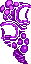
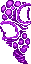

#### Attributes

```
 7  bit  0
 7654 3210
         |
         +- fire direction (0 = face right, 1 = face left)
```

### 3c - Manooki Projectile


### 3d - Eggron

Other Names: Spider Spawn, Alien Spider Spawn, Cocoon

Alien cocoons that create spiders on level 7 (Headquarters).

There are no attributes for this enemy type.

#### Variables

* `ENEMY_VAR_2` - spider spawn delay counter
* `ENEMY_VAR_1` - used to help determine whether the spider spawn is in squashed
  form and should see if can generate spider.  This variable feels unnecessary
  as it is essentially the opposite of ENEMY_FRAME,x.

**ENEMY HP**: #$10, #$14, or #$17

### 3e - Bugger

Other Names: Alien Spider

Level 7 (Headquarters) enemy that is generated by [Eggron](#3d---eggron).

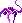

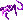

#### Variables

* `ENEMY_VAR_1` - flag determining spider mode
  * 0 = spider crawling on ground
  * 1 = spider in air
* `ENEMY_VAR_6` -  whether off screen vertically

### 3f - Earthquake

Other Names: Jungle Earthquake

Level 3 (Jungle) effect where the ground shakes and collapsed out from under the
players.

#### Variables

* `ENEMY_VAR_1` - current checkpoint index (indexes into
  `jungle_earthquake_x_tbl`). Increments from #$00 to #$0f
* `ENEMY_VAR_2`
* `ENEMY_VAR_3` - how low the collapsing floor sinks to

### 40 - Winged Soldier

Other Names: Hawkman, Garth

Enemy on the Level 4 (Inner Base) (elevator level).  Jumps down from ledge to
attack.

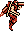
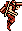


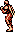
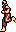
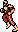
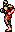

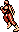

#### Attributes

```
 7  bit  0
 7654 3210
         |
         +- initial X velocity (0 = -1, 1 = 1)
```

#### Variables

* `ENEMY_VAR_1` - number of times winged soldier has run into a wall

### 41 - Winged Soldier Generator

Other Names: Hawkman Generator

### 42 - Laser Chandelier

Other Names: Showerhead

Level 4 (Inner Base) boss

#### Variables

* `ENEMY_VAR_6`
* `ENEMY_VAR_7` - horizontal screen indicator
  * #$ff left of visible screen
  * #$00 visible screen
  * #$01 right of visible screen
* `ENEMY_VAR_2` - laser arm firing direction
  * 0 - right to left
  * 1 - left to right
* `ENEMY_VAR_3` - remaining number of undestroyed
  [Chandelier Arms](#43---chandelier-arm)
* `ENEMY_VAR_1` - laser chandelier subroutine index
  * #$00 - coming in from right for first time
  * #$01 - stopped at left edge
  * #$02 - move right
  * #$03 - stopped at right edge (or past right edge)
  * #$04 - move left
* `ENEMY_VAR_4` - which laser chandelier arm is firing/dropping a laser. When
  negative, specified chandelier arm will know to start dropping a laser
* `ENEMY_FIRING_DELAY` - timer controlling falling of lasers
* `ENEMY_ANIMATION_DELAY` - used as bit field to know which arms are destroyed.
  each arm represents one 1 bit where leftmost bit represents leftmost arm.
  0 = destroyed, 1 = active
  not used for any animation delay

### 43 - Chandelier Arm

**ENEMY HP**: #$10, #$14, or #$18


One of 9 arms of [Laser Chandelier](#42---laser-chandelier), will drop
[Chandelier Arm Lasers](#44---chandelier-arm-laser).  When dropping a laser, the
arm is invincible.

#### Attributes

```
 7  bit  0
 7654 3210
      ||||
      ++++- index from left to right of laser chandelier
```

#### Variables

* `ENEMY_VAR_2` - backup of enemy's HP, used to allow arm to be invincible when
  dropping lasers
* `ENEMY_DELAY` - used to time when to set HP back to normal after being
  invincible during laser drop
* `ENEMY_VAR_1` - animation timer for creating the
  [Chandelier Arm Laser](#44---chandelier-arm-laser)
* `ENEMY_VAR_5` - enemy slot of [Laser Chandelier](#42---laser-chandelier)

### 44 - Chandelier Arm Laser

The part of the chandelier that falls off from the arm.

#### Variables

* `ENEMY_VAR_5` - enemy slot index of [Chandelier Arm](#43---chandelier-arm)

### 45 - Wadder

Other Names: Alien Mouth

Appears on the last level.  'Breathes' 5 times and then opens to generate a
[Red Poisonous Insect Gel](#46---red-poisonous-insect-gel).

**ENEMY HP**: #$0c, #$10, or #$13

#### Attributes

```
 7  bit  0
 7654 3210
        ||
        ++- Y position adjustment index, added to initial Y position when
            initialized (see list below)
```

* 00 = Y position plus 4, used for wadders on flat platforms
* 01 = Y position minus 8
* 10 = Y position minus 1, used for bottom of ascending platform
* 11 = Y position minus 4

#### Variables

* `ENEMY_VAR_2` - animation direction (0 = ascending, 1 = descending)
* `ENEMY_VAR_1` - current frame count within animation sequence
  * #$00 to #$02 - when breathing
number of times to 'breath' before opening mouth and creating
a [Red Poisonous Insect Gel](#46---red-poisonous-insect-gel).
* `ENEMY_FRAME` - there are two animation sequences
  1.  breathe - alternates between #$00 and #$01
  2.  open/create blob/close - #$00, #$01, #$02, #$03, #$02, #$01, #$00
  * #$00 - fully closed
  * #$01 - show teeth
  * #$02 - show more teeth
  * #$03 - fully open
  * #$04 - destroyed

### 46 - Red Poisonous Insect Gel

Other Names: Wadder Spawn Sentient Blob, Red Blob

Red blob on final level generated by [Wadder](#45---wadder).  Immediately
targets player.  After #$40 frames, pauses for #$20 frames, then continually
re-targets the player every 7 frames for #$20 times.  After #$20 re-targets,
the red blob will continue in last direction until off-screen.


There are no attributes for this enemy type.

**ENEMY HP**: #$01

Compare to [Boss Red Poisonous Insect Gel](#2b---boss-red-poisonous-insect-gel),
[Red Poisonous Insect Gel](#35---red-poisonous-insect-gel), and
[Blue Poisonous Insect Gel](#37---blue-poisonous-insect-gel)

#### Variables

* `ENEMY_DELAY`
  * In `final_stage_red_blob_routine_01`, delay before setting `ENEMY_VAR_2`
  * In `final_stage_red_blob_routine_02`, and `final_stage_red_blob_routine_02`,
    delay before re-targeting player
* `ENEMY_VAR_1` - aiming direction, starts at 0 meaning 3 o'clock and increases
  clockwise.  Has #$17 divisions (30 minute increments).
* `ENEMY_VAR_2` - remaining number of times to re-target closest player

### 47 - Jameera

Other Names: Alien Cyclops, Jagger Froid's Spit Soldier

There are no attributes for this enemy type.

**ENEMY HP**: #$10, #$14, or #$17

#### Variables

* `ENEMY_VAR_2` - one less than the number of projectiles remaining to fire
* `ENEMY_DELAY` - the delay until the next projectile is fired

### 48 - Jameera Projectile

Other Names: Alien Cyclops Projectile, Spit

### 49 - Stomping Ceiling

Enemy that appears in level 8.  Technically 2 enemies that appear one after the
other, but looks as a single enemy to the player(s).

#### Attributes

```
 7  bit  0
 7654 3210
  |      |
  |      +- which stomping ceiling instance, specifies where PPUADDR is set
  |        after IRQ (0 = $22e0 (first), 1 = $2ee0 (second))
  +--------
```

#### Variables

* `ENEMY_VAR_1` - stomp state
  * #$00 - stomping
  * #$01 - slammed at bottom
  * #$02 - waiting to ascend
  * #$03 - ascending
  * #$04 - waiting to descend
* `ENEMY_VAR_7` - screen number of the ceiling, each instance has 3 screens
  * #$ff, #$fe, #$fd

### 4b - Fortress Wall Core

Other Names: Sensor

Level 3 (Jungle) boss target.  The core is the center orb that once destroyed
causes the entire fortress wall to be defeated.  It flashes red and black.

**ENEMY HP**: #$28, #$38, or #$40

#### Variables

* `ENEMY_VAR_2` - 1 = all [Fortress Wall Turret](#50---fortress-wall-turret) are
  ready to being rotation, 0 = do not start rotation
* `ENEMY_VAR_6`
* `ENEMY_VAR_1` - `fortress_wall_core_subroutine_tbl` offset
* `ENEMY_VAR_5`
* `ENEMY_VAR_4` - once destroyed, counts the number of remaining explosions for
  the destruction animation

### 4e - Robot Spider

Other Names: Spidal, Babalu Defense Mechanism

**ENEMY HP**: #$30, #$40, or #$48

#### Variables

* `ENEMY_VAR_4` - robot spider direction (0 = to the right, 1 = to the left)
* `ENEMY_VAR_7` - horizontal screen indicator
  * #$ff left of visible screen
  * #$00 visible screen
  * #$01 right of visible screen
* `ENEMY_VAR_3` - logic routine index
  * 0 = do nothing
  * 1 = update collision bg data,
  * 2 = 
  * 3 = draw black bg tiles, do not set floor attribute tiles
  * 4 = draw black bg tiles
  * 5 = draw striped gray floor tile
* `ENEMY_VAR_2` - specifies nametable to use (0 = $2000, 2 = $2800).  Enables
  drawing the robot spider without any graphical glitching

### 50 - Fortress Wall Turret

Other Names: Sensor

Level 3 (Jungle) boss turret.  Rotates around
[Fortress Wall Core](#4b---fortress-wall-core) and flashes between purple and
teal.  When purple, the turret is invincible and cannot take damage from player
bullets, but if player is invincible (B weapon), can be destroyed through player
enemy collision.  Having the B weapon is not possible without a game cheat.

**ENEMY HP**: #$10, #$14, or #$17


#### Attributes

```
 7  bit  0
 7654 3210
         |
         +- position index where turret is located [#$00-#$0b]
```

#### Variables

* `ENEMY_VAR_2` - stores HP of the turret so can be reset after no longer
  invincible.
* `ENEMY_VAR_1` - location slot index of where the core is
  * #$00-#$02 = 3 positions above fortress wall core
  * #$03-#$05 = 3 positions right of fortress wall core
  * #$06-#$08 = 3 positions below fortress wall core
  * #$09-#$0b = 3 positions left of fortress wall core
* `ENEMY_VAR_5` - enemy slot index of
  [Fortress Wall Core](#4b---fortress-wall-core)
* `ENEMY_FIRING_DELAY` - turret firing delay

### 51 - Temple of Terror Skull

Other Names: Dethgerbis, Shadow Beast Demon Statue, Temple of Terror Skull

Level 7 (Headquarters) boss

**ENEMY HP**: #$20, #$30, or #$38

#### Variables

* `ENEMY_VAR_2` - Temple of Terror Skull's HP, used inst of ENEMY_HP,x which is
  set to special invincible HP

### 52 - Temple of Terror Core

**ENEMY HP**: #$18, #$1c, or #$1f

#### Variables

* `ENEMY_VAR_1` - Temple of Terror Core's HP, used inst of ENEMY_HP,x which is
  set to special invincible HP
* `ENEMY_VAR_5` - enemy slot index of Temple of Terror Skull enemy

### 53 - Temple of Terror Acid Drop Generator

Other Names: Temple of Terror Poison Drop Generator

**ENEMY HP**: #$10, #$14, or #$17

#### Variables

* `ENEMY_VAR_5` - enemy slot index of Temple of Terror Skull enemy

### 54 - Temple of Terror Fire Ring Projectile

Other Names: Temple of Terror Core Fire Ring Projectile


**ENEMY HP**: 3

### 55 - Temple of Terror Poisonous Insect Gel

Other Names: Red Sentient Blob, Red Blob


### 56 - Temple of Terror Poison Drop


### 58 - Storage Room Soldier Generator

Other Names: Storage Bay

Level 5 storage room that generates 3 soldiers.

There are no attributes for this enemy type.

#### Variables

* `ENEMY_VAR_1` - number of remaining soldiers to generate, initialized to 3

### 59 - Krypto-Crustacean

Other Names: Giralal

Level 5 (The Cliff) boss

#### Variables

* `ENEMY_ATTRIBUTES` - keeps track of animation frame index of the bottom 3
  ports of the krypto-crustacean when creating
  [Red Poisonous Insect Gel](#35---red-poisonous-insect-gel)
* `ENEMY_VAR_3` - flight mode
  * #$00 - initial float into level
  * #$01 - float left and right
  * #$02 - dip down
  * #$03 - rise back
* `ENEMY_DELAY` - used to time how long to pace left/right, when pacing
  decremented every even frame
* `ENEMY_VAR_1` - used to adjust Y velocity when rising/descending (see
  modify_enemy_y_vel)
* `ENEMY_VAR_6` - vertical screen indicator
  * #$ff above visible screen
  * #$00 visible screen
  * #$01 below visible screen
* `ENEMY_FIRING_DELAY` - delay timer before creating [Alien Skull](#5a---alien-skull)
* `ENEMY_VAR_4`
  * delay timer for animating the port opening for creating the
    [Red Poisonous Insect Gel](#35---red-poisonous-insect-gel)
  * once destroyed, counts the number of remaining explosions for the
    destruction animation
* `ENEMY_VAR_5` - used when descending into level, 0 = descending, 1 = to start
  slowing descent and get to pace/left right. Remains 1 after this.

### 5a - Alien Skull

Enemy thrown out from [Krypto-Crustacean](#59---krypto-crustacean) with an
initial X velocity of +/-0.5 and an initial Y velocity of -1.25.  Once landed on
the ground, their HP is set to #$01, and their X velocity is set to +/-1.25.

**ENEMY HP**: #$02, #$06, or #$0a

#### Attributes

```
 7  bit  0
 7654 3210
         |
         +- X velocity
              * falling X velocity (0 = 0.5, 1 = -0.5)
              * ground crawl X velocity (0 = -1.25, 1 = 1.25)
```

### 5b - Rotating Turret

Other Names: Overhead Rotating Turret

**ENEMY HP**: #$09, #$0c, or #$0f

There are no attributes for this enemy type.

#### Variables

* `ENEMY_VAR_1` - aim direction [#$00-#$17]
* `ENEMY_VAR_2` - overhead aim direction for bg tiles [#$00-#$04]. Can fire at
  #$05, but bg tiles will show it firing at #$04 (9 o'clock).
  * #$00 - 3 o'clock
  * #$01 - 4:30 o'clock
  * #$02 - 6 o'clock
  * #$03 - 7:30 o'clock
  * #$04 - 9:00 o'clock
* `ENEMY_VAR_4`
  * the remaining number of bullets to fire per attack round
  * once destroyed, counts the number of remaining explosions for the
    destruction animation
* `ENEMY_FIRING_DELAY` - delay before firing at player
* `ENEMY_DELAY` - target player delay
* `ENEMY_VAR_3` - player index of player to target

### 5c - Stationary Red Soldier

Overhead level (level 2) stationary red soldier, compare to
[Overhead Soldier](#63---overhead-soldier) which moves and can also be red.

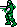
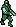
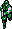
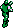


#### Variables

* `ENEMY_VAR_4` - one less than the number of bullets to fire per attack round
* `ENEMY_VAR_1` - aim direction [#$00-#$17]
  * #$00 - 3 o'clock
  * #$06 - 6 o'clock
  * #$0c - 9 o'clock
  * #$12 - 12 o'clock
* `ENEMY_VAR_2` - offset specifying which sprite to use
* `ENEMY_FIRING_DELAY` - firing delay
* `ENEMY_VAR_3` - targeted player
* `ENEMY_DELAY` - delay before updating the sprite to aim towards player

### 5d - Mouth Pit

Other Names: Bakonga, Maw Type, Sarlacc, Fruit of the Doom

**ENEMY HP**: #$06, #$0a, or #$0d

#### Attributes

```
 7  bit  0
 7654 3210
         |
         +- 1 = 2 open/close cycles, 0 = open/close repeatedly until destroyed
            or offscreen
```

#### Variables

* `ENEMY_VAR_1` - animation direction 0 = opening, 1 = closing
* `ENEMY_VAR_2` - number of times to open and close. If #$ff, from level enemy
  screen and opens/closes repeatedly until destroyed or offscreen

### 5e - Mouth Pit Generator

#### Variables

* `ENEMY_VAR_2` - screen in which generator exist, #$00, #$01, #$02, then #$80

### 5f - Big Faced One-Eyed Monster

Level 6 (Entry to HQ) monster that spawn at the top or bottom of screen and
targets a specific player, circling the player until destroyed or reach blue
floor portion of level.


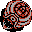
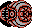

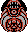

#### Attributes

```
 7  bit  0
 7654 3210
         |
         +- 1 = spawn from bottom, 0 = spawn from top
```

#### Variables

* `ENEMY_VAR_1` - player index of player to target
* `ENEMY_VAR_4` - targeted player X position
* `ENEMY_VAR_3` - targeted player Y position
* `ENEMY_VAR_2` - parameterized position along circle around player. [#$00-#$7f]

### 60 - Baby Alien Ladybug

See Also: [Alien Ladybug](#24---alien-ladybug) and
[Boss Screen Baby Alien Ladybug](#61---boss-screen-baby-alien-ladybug)


#### Attributes

```
 7  bit  0
 7654 3210
         |
         +- 1 = left side, 0 = right side
```

#### Variables

* `ENEMY_VAR_1` - Y position of where baby alien ladybug was spawned. When set
  #$ff (scrolled to bottom of screen), the enemy is removed instead of spawned
  again.

### 61 - Boss Screen Baby Alien Ladybug

See Also: [Alien Ladybug](#24---alien-ladybug)
and [Baby Alien Ladybug](#60---baby-alien-ladybug)

#### Variables

* `ENEMY_VAR_1`

### 62 - Intro Helicopter

Helicopter with rotating rotor blades that Bill and Lance drop into level 1
from.  It is responsible for some lightning flashes.

There are no attributes for this enemy type.

#### Variables

* `ENEMY_VAR_1` - 0 = lightning bg, 1 = normal bg
* `ENEMY_VAR_2` - number of times lightning has flashed before the player drops
  into the level, goes from #$00 to #$03

### 63 - Overhead Soldier

Marching soldiers that appear only on level 2. The soldiers that appear on Level
5 (The Cliff), and Level 7 (Headquarters) are [Soldier](#03---soldier).
Soldiers can be red or green depending on enemy attributes.  Red soldiers fire
at the player.  Note these red soldiers are different from
[Stationary Red Soldier](#5c---stationary-red-soldier), which are stationary,
but also appear on level 2.

Overhead soldiers can appear from the top or bottom of the screen.  When they
appear from the top, they will target the player until the player is above the
soldier, then they will target the bottom of the screen.  When the overhead
soldiers appear from the bottom of the screen, they will walk upwards targeting
the player until they are above the player, then they will start walking
downward until they are below the player, then target a random position on the
bottom of the screen.

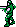
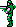

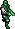
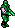

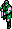
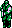

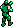


#### Attributes

```
 7  bit  0
 7654 3210
        ||
        |+- initial walk direction (0 = down, 1 = up)
        +-- sprite palette (0 = green, 1 = red)
```

#### Variables

* `ENEMY_VAR_1` - aim direction
  * #$00 - 3 o'clock
  * #$06 - 6 o'clock
  * #$0b - 9 o'clock
* `ENEMY_VAR_2` - converted aim direction from `ENEMY_VAR_1`. Used for
  determining which sprite attribute and velocity (direction) to use.
  * #$00 - 3 o'clock
  * #$07 - 10:30 o'clock
* `ENEMY_VAR_4` - player index to target
  * when negative, target closest player when firing
  * when bit 6 set, walking upward
* `ENEMY_VAR_3` - overhead soldier bg collision direction
  * #$01 - overhead soldier is moving rightward (collision to right)
  * #$02 - overhead soldier is moving leftward (collision to left)
  * #$03 - overhead soldier is moving down (collision below)
  * #$04 - overhead soldier is moving up (collision above)
* `ENEMY_FIRING_DELAY` - red soldier firing delay
* `ENEMY_VAR_5` - red soldier sprite recoil delay timer

### 64 - Suspicious Face

Other Names: Hydra Alien

Level 6 miniboss.  Plays sound #$32 "Creature from Outer Space (Boss 3)"
(BOSS2BGM) when shown.

**ENEMY HP**: #$20, #$30, or #$38

#### Variables

* `ENEMY_FRAME` - controls which bg tiles are shown
  * #$00 - mouth closed
  * #$01 - mouth mostly closed
  * #$02 - mouth open
  * #$03 - destroyed frame top (cave)
  * #$04 - destroyed frame bottom (cave)
* `ENEMY_FIRING_DELAY` - bullet fire delay timer
* `ENEMY_DELAY` - animation timer
* `ENEMY_VAR_2` - when odd, decrement ENEMY_FRAME, otherwise increment
  * even when suspicious face is closed, odd when open
* `ENEMY_VAR_4` - once destroyed, counts the number of remaining explosions for
  the destruction animation

### 65 - Jagger Froid

Other Names: Gava, Emperor Demon Gava

#### Variables

* `ENEMY_FRAME` - controls which bg tiles are shown
  * #$03 - destroyed frame top (cave)
  * #$04 - destroyed frame bottom (cave)
  * #$05 - jagger froid
  * #$06 - jagger froid mouth in
  * #$07 - jagger froid mouth out
* `ENEMY_VAR_1`
  * before revealed, used as a countdown timer
  * after revealed, stores the first interrupt scanline
  * when active, counts total number of
    [Jagger Froid Projectiles](#68---jagger-froid-projectile) created
* `ENEMY_VAR_4`
  * when coming out of the cave, used to know which tiles to draw on the
    non-visible nametable since it takes multiple frames to draw
  * when active, specifies eye look direction
    * #$00 - look left
    * #$01 - look center
    * #$02 - look right
  * once destroyed, counts the number of remaining explosions for the
    destruction animation
* `ENEMY_VAR_2`
  * when coming out of cave, alternates between 0 and 1 to show different
    nametables to allow jagger froid to be drawn over multiple frames
  * when initializing, delay before creating
    [Alien Serpent](#66---alien-serpent)
  * when active, controls whether mouth is open or closed (0 = closed, 1 = open)
* `ENEMY_VAR_3`
   * when coming out of cave, specifies how far out (#$00 = not visible, #$0f =
     fully out)
   * when active, whether or not the graphics buffer is full and can't update
     eye direction
* `ENEMY_VAR_5` - when coming out of the cave and drawing jagger froid on the
  non-visible nametable, used to know how many groups of tiles to draw
* `ENEMY_FIRING_DELAY` - timer for creating
  [Jagger Froid Projectiles](#68---jagger-froid-projectile)

**ENEMY HP**: #$40, #$50, or #$58

### 66 - Alien Serpent

Created by [Jagger Froid](#65---jagger-froid). 7 individual enemies acting as a
single serpent monster.

Other Names: Alien Worm

**ENEMY HP**: #$18, #$1c, or #$1f


#### Variables

* `ENEMY_VAR_3` - the number of the serpent part within the snake, head is 0,
  ascending up to 6.
* `ENEMY_VAR_5` - enemy slot index of next serpent part within the snake
* `ENEMY_VAR_1` - used by head to set direction of movement
* `ENEMY_VAR_2` - used for alien serpent head routine index
* `ENEMY_VAR_4` - used by head to keep track of animation routine, loops from 0
  to 3 inclusively. Incremented each time the serpent leaves the cave

### 68 - Jagger Froid Projectile

A projectile fired by [Jagger Froid](#65---jagger-froid).  It targets the
closest player repeatedly after a delay.


There are no attributes for this enemy type.

### 69 - Tank Boss

Other Names: Magnus

Level 2 (Base Area 2) boss green soldier in center of tank that has
[Tank Boss Electrode](#36---tank-boss-electrode).  Note that this soldier is
different from the blue tank soldiers that appear 3 times on the same level.
Those are [Overhead Tank Soldier](#2e---overhead-tank-soldier).  Also, the 2 red
tank soldiers on the boss tank are [Tank Gunners](#6a---tank-gunner).

**ENEMY HP**: #$20, #$30, or #$38

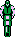
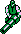
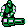

#### Variables

* `ENEMY_VAR_1` - used when drawing the floor tiles over enemy after the reveal
* `ENEMY_VAR_4`
  * subroutine index into tank_boss_subroutine_ptr_tbl
  * once destroyed, counts the number of remaining explosions for the
    destruction animation
* `ENEMY_VAR_6`
* `ENEMY_FIRING_DELAY` - timer before changing direction
* `ENEMY_VAR_1` - used when calculating aim direction !(TODO)
* `ENEMY_VAR_2` - overhead aim direction
  * #$00 - right
  * #$01 = down right
  * #$02 = down
  * #$03 = down left
  * #$04 = left
* `ENEMY_VAR_5` - how much the [Tank Boss Electrode](#36---tank-boss-electrode)
  has retraced/extended.

### 6a - Tank Gunner

Level 2 (Base Area 2) boss red soldiers on the sides of the boss tank that has
[Tank Boss Electrode](#36---tank-boss-electrode).  Note that these soldiers are
different from the blue tank soldiers that appear 3 times on the same level.
Those are [Overhead Tank Soldiers](#2e---overhead-tank-soldier).  Also, the green
tank soldier in the center of the boss tank is [Tank Boss](#69---tank-boss).

**ENEMY HP**: #$10, #$14, or #$17

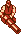


#### Attributes

```
 7  bit  0
 7654 3210
         |
         +- gunner index (0 = right, 1 = left)
```

#### Variables

* `ENEMY_VAR_3` - enemy slot index of [Tank Boss](#69---tank-boss)
* `ENEMY_VAR_4`
  * player index of player to target (0 = p1, 1 = p2)
  * once destroyed, counts the number of remaining explosions for the
    destruction animation
* `ENEMY_FIRING_DELAY` - firing delay
* `ENEMY_VAR_1` - aim direction, e.g. 6 = down
* `ENEMY_VAR_2` - overhead aim direction, used to determine appropriate sprite.
  Can contain aim directions gunner can't fire in, e.g. up
  * #$00 - right
  * #$01 - down right
  * #$02 - down
  * #$03 - down left
  * #$04 - left
  * #$05 - left up
  * #$06 - up
  * #$07 - up right
* `ENEMY_VAR_5` - recoil effect timer

### 6b - Bubbles

Enemy on level 4 (Base Area 3) in beginning hallway created by
[Ceiling Vent](#6c---ceiling-vent).

**ENEMY HP**: #$01


There are no attributes for this enemy type.

### 6c - Ceiling Vent

Enemy on level 4 (Base Area 3) in beginning hallway on the ceiling that creates
#$14 (20 in decimal) [Bubbles](#6b---bubbles) each with an HP of #$01.

**ENEMY HP**: #$20

There are no attributes for this enemy type.

#### Variables

* `ENEMY_VAR_1` - total number of bubbles to create before stopping
* `ENEMY_DELAY` - delay before creating next bubble

### 6d - Kimkoh

Other Names: Final Boss

**ENEMY HP**: #$30, #$40, or #$48

#### Variables

* `ENEMY_VAR_4`
  * when boss is rising, indicates game should do earthquake effect.  When boss
    receding, counts down for earthquake effect.
  * counts up the number of
    [Blue Poisonous Insect Gel](#37---blue-poisonous-insect-gel) created
  * once destroyed, counts the number of remaining explosions for
    the destruction animation
* `ENEMY_FIRING_DELAY` - delay before creating #$08
  [Boss Red Poisonous Insect Gel](#2b---boss-red-poisonous-insect-gel)
* `ENEMY_VAR_1`
* `ENEMY_VAR_6`
* `ENEMY_VAR_3` - eye opening state (0 = opening, 1 = closing)
* `ENEMY_VAR_2` - remaining number of times to blink before firing #$08
  [Boss Red Poisonous Insect Gel](#2b---boss-red-poisonous-insect-gel)
* `ENEMY_FRAME` - controls animation of eye
  * #$00 - closed
  * #$01 - half open
  * #$02 - open

### 6e - Falling Rubble

Crumbling rock for [Kimkoh](#6d---kimkoh) (final boss) on Level 8 (The Final
Stage).  First a wall of rock crumbles before the final boss is revealed.  Then,
shown again as the final boss ascends from the ground.


#### Attributes

```
 7  bit  0
 7654 3210
        ||
        ++- 3 times this amount plus #$24 is the initial Y position when
            ENEMY_VAR_2 is #$00
```

#### Variables

* `ENEMY_VAR_2` - whether or not to have random initial position and initial x
  and y velocities.  0 for crumbling wall for final boss, 1 for crumbling rock
  as final boss ascends from ground.
  * 0 = use `ENEMY_VAR_1` for initial X position and attributes for Y position
  * 1 = use random X position and #$c0 as initial Y position. Use random initial
    X and Y velocities
* `ENEMY_VAR_1` - initial X position and initial animation delay
  * initial X position is offset into `falling_rubble_initial_x_pos_tbl`
    * #$00 = #$e8
    * #$01 = #$f0
    * #$02 - #$f8
  * initial animation delay is offset into `falling_rubble_anim_delay_tbl`
    * #$00 = #$00
    * #$01 = #$06
    * #$02 - #$03

### 6f - Background Storm

Enemy used to create a storm effect on level 1.  Sound played is `sound_1d`.

There are no attributes for this enemy type.

#### Variables

* `ENEMY_VAR_1` - 0 = lightning bg, 1 = normal bg
* `ENEMY_VAR_2` - number of times lightning has flashed before the player drops
  into the level, goes from #$00 to #$03
* `ENEMY_DELAY` - lightning flash delay

### 70 - Suspicious Face Arm

Generates [Boss Screen Baby Alien Ladybug](#61---boss-screen-baby-alien-ladybug)
repeatedly.  The first generation of boss screen baby alien ladybugs happens
after a #$70 frame delay. All subsequent generations happen after a #$f0 frame
delay.

This enemy cannot be destroyed.

There are no attributes for this enemy type.

#### Variables

* `ENEMY_DELAY` - delay before creating
  [Boss Screen Baby Alien Ladybug](#61---boss-screen-baby-alien-ladybug)

### 71 - Area 6 Tile Swapper

Level 6 (Entry to HQ) invisible enemy that manages a scanline interrupt that
changes the left pattern table tiles (background tiles) to use different tiles
after the scanline interrupt.  Then this enemy will adjust the interrupt
scanline as the screen is scrolled so that it stays at the same spot in relation
to the level.

Appears twice in the level

1. Before the miniboss door to allow the area above the scanline to have the
tiles for showing the gray alien wall (banks #50 and #52), and the area below
the scanline to have the tiles to show the baby alien ladybug generator skulls
(banks #$4c and #$52).  See `irq_handler_0e_00`

2. During miniboss and boss screen to allow the area above the scanline to have
the tiles for showing the miniboss (#$54 and #$56) or boss (#$54 and #$58), and
the area below the scanline to have the tiles to show the gray alien wall
(#50 and #52).  See `irq_handler_0f_00`

#### Attributes

```
 7  bit  0
 7654 3210
         |
         +- location (0 = before first door, 1 = suspicious face and jagger
            froid)
```

When the location is 0 (before first door), the left pattern table tile banks
for before the scanline interrupt are set to #$50 and #$52.  `irq_handler_0e_00`
is enabled so that after the interrupt the left pattern table banks are #$4c and
#$52.  The starting scanline #$06 and this is adjusted based on vertical scroll
every frame.

When the location is 1 (suspicious face and jagger froid), the left pattern
table tile banks for before the scanline interrupt are set to #$54 and #$56.
`irq_handler_0f_00` is enabled so that after the interrupt the left pattern
table banks are #$50 and #$52.  The starting scanline #$08 and this is adjusted
based on vertical scroll every frame.