When a scanline interrupt occurs, the irq label is called and the appropriate
routine is loaded based on IRQ_ROUTINE

# Interrupts

## 01 - Level 1 Boss

* IRQ Handler: `irq_handler_01_ptr_tbl`

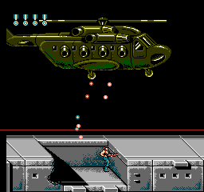

## 02 - Level 4 Elevator

* IRQ Handler: `irq_handler_02_ptr_tbl`

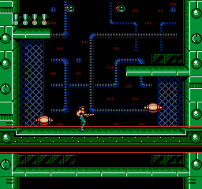

* `irq_handler_02_00`

## 03 - End Credits

* IRQ Handler: `irq_handler_03_ptr_tbl`

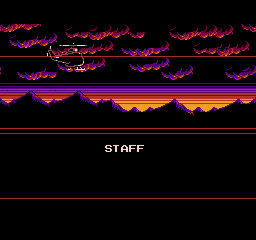

* *`irq_handler_03_00`
  * scanline #$38 - set next scanline irq, horizontally scroll clouds
* `irq_handler_03_01`
  * scanline #$59 - horizontally scroll mountains (parallax effect)
* `irq_handler_03_02`
  * scanline #$7d - clear left pattern table, set PPU address and scroll, set vertical mirroring
* `irq_handler_03_03`
  * scanline #$85 - restore left pattern table tiles (contains text tiles)
* `irq_handler_03_04`
  * scanline #$c6 - set left pattern table to all black

## 04 - Level 4 Boss

* IRQ Handler: `irq_handler_04_ptr_tbl`

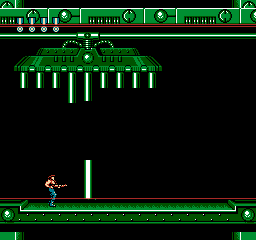

* `irq_handler_04_00` - This interrupt handler fires after the ceiling tiles
  have been drawn to the screen.  It always occurs on scanline #$18.
  * Sets the next scanline interrupt to occur after #$01 scanline
  * Sets the appropriate base nametable ($2000 or $2400)
  * Sets horizontal scroll
  * Swaps out the pattern table bank (left pattern table) to #$08 and #$14
* `irq_handler_04_01` - This interrupt handler fires #$01 scanline after the
previous interrupt.  It always occurs on scanline #$1a.
  * Sets the next scanline interrupt to occur after #$ab scanline
* `irq_handler_04_02` - This interrupt handler fires #$ab scanline after the
previous interrupt.  It always occurs on scanline #$c6.  The scanline interrupt
happens to render the floor tiles.
  * Sets base nametable to $2400
  * Sets X scroll to #$00
  * Swaps out the pattern table bank (left pattern table) to #$08 and #$0a

## 06 - Level 8 Stomping Ceiling

* IRQ Handler: `irq_handler_06_ptr_tbl`

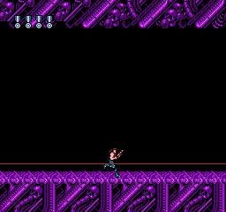

* `irq_handler_06_00`
  * Triggers at scanline 252 (72% of screen)
  * Set PPU address $22e0 or $2ee0to show ground portion for screen
  * Applies horizontal scroll so ground scrolls

## 07 - Level 3 Boss

* IRQ Handler: `irq_handler_07_ptr_tbl`

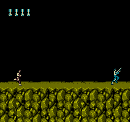

## 09 - Level 7 Boss

* IRQ Handler: `irq_handler_09_ptr_tbl`

A simple scanline interrupt handler that changes left pattern table top half
tiles (background tiles) from #$2c to #$30.  The left pattern table bottom half
is updated, but it is set to the alreayd set value of #$2e.  This allows the
area above the scanline to have the tiles for showing the skull (#2c), and the
area below the scanline to have the tiles to animate the core (#$30).

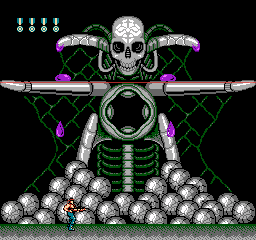

* `irq_handler_09_00` - Always occurs after scanline #$52.  Changes left top
pattern table tiles (background tiles) from #$2c to #$30.

## 0b - Level 5 Boss

* IRQ Handler: `irq_handler_0b_ptr_tbl`

A handler that changes the PPU address and scroll to show the ground and updates
the left pattern table tiles (background tiles).

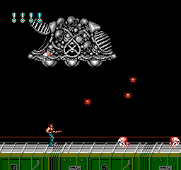

* `irq_handler_0b_00` - Always occurs after scanline #$c1.
  * Sets PPU address to show ground
  * Sets left pattern table tiles (background tiles) from #$5a (top half) and
    #$06 (bottom half) to #$20 (top half) and #$22 (bottom half)

## 0c - Level 2 Boss

* IRQ Handler: `irq_handler_0c_ptr_tbl`

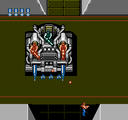

* `irq_handler_0c_00` - This interrupt handler is hit after the first scanline
interrupt.  At this point, the top part of the screen's background has been
rendered, which is the exit and 2 walls.  This interrupt handler is to determine
how tall the empty region before the 2nd interrupt is triggered.  This is to
allow fine grain Y scrolling for the tank boss.  `tank_boss_set_irqs` will
calculate the height of this region.
  * Sets next scanline interrupt based on `SPLIT_SCANLINE_IRQ_2`.  This value is
    calculated from `tank_boss_set_irqs` and set based on `IRQ_Y_SCROLL`.  It'll
    be (`IRQ_Y_SCROLL` & #$07) + 1.  It'll range from #$01 to #$08.
  * Updates PPU address to appropriate nametable row based on `IRQ_Y_SCROLL`
* `irq_handler_0c_01` - This interrupt handler is triggered after the region
above of height between #$01 and #$08 scanlines has been rendered.  It is always
triggered on scanline #$29. All it does is set the next interrupt to occur after
#$97 scanlines. This is the main region where the tank boss is rendered.
* `irq_handler_0c_02` - This interrupt handler is triggered after the tank boss
has been rendered, and sets the PPU address to the correct location to draw the
alley and 2 walls at the bottom of the screen.
  * Sets the PPU address to $2300
  * Clears any horizontal scroll

## 0d - Level 8 Final Boss

* IRQ Handler: `irq_handler_0d_ptr_tbl`
* IRQ scanline interrupts configured in `final_boss_set_irq_data`.

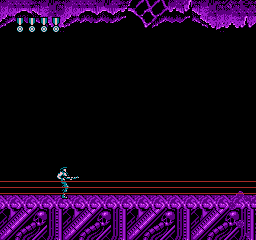

* `irq_handler_0d_00` - This interrupt handler is hit after the first scanline
interrupt.  At this point, the top part of the screen's background has been
rendered, including the cave stalactites.  This interrupt is triggered earlier
and earlier as to give space for the final boss to rise.
  * Swaps out the pattern table bank (left pattern table) to #$70 and #$72
  * Sets PPU address to $2cc0
  * Sets next scanline interrupt based on `SPLIT_SCANLINE_IRQ_2`.  This sets the
    interrupt to occur in #$05 scanlines.
* `irq_handler_0d_01` - occurs #$05 scanlines after `irq_handler_0d_00`.  This
interrupt handler is responsible for setting the next scanline interrupt based
on how much of the boss is visible as it rises.
  * Sets next scanline interrupt based on `SPLIT_SCANLINE_IRQ_3`, which is set in
  `init_scanline_irq`, which comes from `SCANLINE_IRQ_3_DIFF`, which is calculated
  in `final_boss_set_irq_data`.
* `irq_handler_0d_02` - always occurs at scanline #$c1
  * Swaps out the pattern table bank (left pattern table) to #$6c and #$6e
  * Sets PPU address to $2300
  * Acknowledges the interrupt, restores registers, and rti

### 0e - Level 6 Before First Door

* IRQ Handler: `irq_handler_0e_ptr_tbl`
* IRQ scanline interrupts configured in `area_6_chr_swap_routine_00` and
  `area_6_chr_swap_routine_01` (enemy type #$71).

A very simple scanline interrupt handler that changes left pattern table tiles
(background tiles) from #$50, and #$52 to #$4c, and #$52.  This allows the area
above the scanline to have the tiles for showing the gray alien wall (#50 and
#52), and the area below the scanline to have the tiles to show the baby alien
ladybug generator skulls (#$4c and #$52).

This scanline is moved based on vertical scroll so that it occurs at the same
spot on the level between the gray alien wall and the alien skulls.

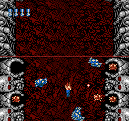

* `irq_handler_0e_00` - Changes left pattern table tiles (background tiles) from
#$50, and #$52 to #$4c, and #$52.

## 0f - Level 6 Miniboss and Boss

* IRQ Handler: `irq_handler_0f_ptr_tbl`
* IRQ scanline interrupts configured in `area_6_chr_swap_routine_00` and
  `area_6_chr_swap_routine_01` (enemy type #$71).

A very simple scanline interrupt handler that changes left pattern table tiles
(background tiles) from #$54, and #$56 (miniboss) or from #$54 and #$58 (boss)
to #$50, and #$52.  This allows the area above the scanline to have the tiles
for showing the miniboss or boss, and the area below the scanline to have the
tiles to show the gray alien wall (#50 and #52).

This scanline is moved based on vertical scroll so that it occurs at the same
spot on the level after the miniboss or boss and before the gray alien wall.

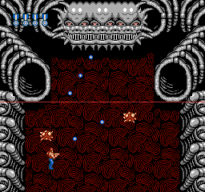