This folder contains every sprite that can be loaded in Super C.  The sprites
here are not used by the game code, they were extracted from the ROM for ease of
viewing.

The name of each sprite is the same as the label in bank-6.asm in the 3 sprite
tables `player_sprite_ptr_tbl`, `sprite_ptr_tbl_0`, and `sprite_ptr_tbl_1`.

The player lives medals in the heads up display (HUD) are not in the sprite
tables, but the tiles are written directly to the OAMDMA via the CPU buffer.

# Sprite Table

## Super C (US)

### Player Sprites

|   | 0                                                                                                                                                                  | 1                                                                                                                                                                  | 2                                                                                                                                                                  | 3                                                                                                                                                                  | 4                                                                                                                                                                  | 5                                                                                                                                                                  | 6                                                                                                                                                                  | 7                                                                                                                                                                  | 8                                                                                                                                                                  | 9                                                                                                                                                                  | a                                                                                                                                                                  | b                                                                                                                                                                  | c                                                                                                                                                                  | d                                                                                                                                                                  | e                                                                                                                                                                  | f                                                                                                                                                                  |
|---|--------------------------------------------------------------------------------------------------------------------------------------------------------------------|--------------------------------------------------------------------------------------------------------------------------------------------------------------------|--------------------------------------------------------------------------------------------------------------------------------------------------------------------|--------------------------------------------------------------------------------------------------------------------------------------------------------------------|--------------------------------------------------------------------------------------------------------------------------------------------------------------------|--------------------------------------------------------------------------------------------------------------------------------------------------------------------|--------------------------------------------------------------------------------------------------------------------------------------------------------------------|--------------------------------------------------------------------------------------------------------------------------------------------------------------------|--------------------------------------------------------------------------------------------------------------------------------------------------------------------|--------------------------------------------------------------------------------------------------------------------------------------------------------------------|--------------------------------------------------------------------------------------------------------------------------------------------------------------------|--------------------------------------------------------------------------------------------------------------------------------------------------------------------|--------------------------------------------------------------------------------------------------------------------------------------------------------------------|--------------------------------------------------------------------------------------------------------------------------------------------------------------------|--------------------------------------------------------------------------------------------------------------------------------------------------------------------|--------------------------------------------------------------------------------------------------------------------------------------------------------------------|
| 0 |                                                                                                                                                                    | 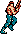 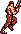 | 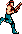 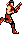 |   |  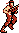 | 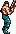  | 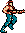 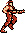 | 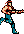 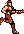 | 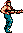  |   |   | 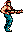 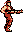 | 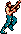 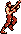 | 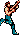  |   | 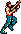 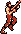 |
| 1 |  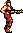 |   | 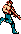 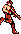 |   | 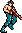 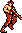 | 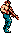  |   |   |   |   |   |   |   |   | 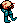 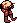 |   |
| 2 |   |   |   | 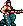 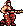 | 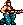  |  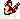 |                                                                                        |                                                                                        |                                                                                        | 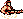                                                                                       |                                                                                        |                                                                                        |   |   |   |   |
| 3 |   |   |   |   |   |   |   |   |   |   |   | 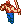 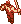 |   |   |                                                                                                                                                                    |                                                                                                                                                                    |

Note that there is no distinction between player 1 and player 2 when in water.

### Sprites

|   | 0                                                       | 1                                                       | 2                                                       | 3                                                       | 4                                                       | 5                                                       | 6                                                       | 7                                                       | 8                                                       | 9                                                       | a                                                                                                                                                         | b                                                                                                                                                         | c                                                       | d                                                       | e                                                       | f                                                       |
|---|---------------------------------------------------------|---------------------------------------------------------|---------------------------------------------------------|---------------------------------------------------------|---------------------------------------------------------|---------------------------------------------------------|---------------------------------------------------------|---------------------------------------------------------|---------------------------------------------------------|---------------------------------------------------------|-----------------------------------------------------------------------------------------------------------------------------------------------------------|-----------------------------------------------------------------------------------------------------------------------------------------------------------|---------------------------------------------------------|---------------------------------------------------------|---------------------------------------------------------|---------------------------------------------------------|
| 0 |                                                         |                                                         |  |  |  |  |  |  |  |  |                                                                                                    |                                                                                                    |  |  |  |  |
| 1 |  |  |  |  |  |  |  |  |  |  |                                                                                                    | 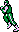                                                                                                   | 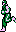 |  | 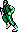 |  |
| 2 | 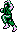 | 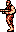 |  |  |  |  |  |  |  |  |                                                                                                    |                                                                                                    |  |  |  |  |
| 3 |  |  |  |  |  |  |  |  |  | 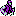 |                                                                                                    | 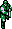                                                                                                   |  |  |  |  |
| 4 |  |  |  |  |  |  |  |  |  |  |                                                                                                    |                                                                                                    |  |  |  |  |
| 5 |  |  |  |  |  | 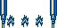 | 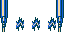 | 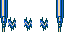 | 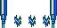 |  |                                                                                                    |                                                                                                    |  |  |  |  |
| 6 |  |  |  |  |  |  |  |  |  |  |                                                                                                    |                                                                                                    |  |  |  |  |
| 7 |  |  |  |  |  |  |  |  |  |  |                                                                                                    |                                                                                                    |  |  |  |  |
| 8 |  |  |  |  |  |  |  |  |  |  |                                                                                                    |                                                                                                    |  |  |  |  |
| 9 |  |  |  |  |  |  |  |  |  |  |                                                                                                    |                                                                                                    |  |  |  |  |
| a |  |  |  |  |  |  |  |  |  |  |   |   |  |  |  |  |
| b |  |  |  |  |  |  |  |  |  |  |                                                                                                    |                                                                                                    |                                                         |                                                         |                                                         |                                                         |

### Hud Sprites

# Super C (US)
* Player 1
  * 
  * 
* Player 2
  * 
  * 

### Unused Sprites
* `sprite_22` 
* `player_sprite_26` 
* `player_sprite_28` 

### Duplicate Sprites

* `player_sprite_16` 
  (crouch) is a duplicate of `player_sprite_17` 
  (crouch with recoil)
* `player_sprite_26` 
  (splash) is a duplicate of `player_sprite_27` 
  (splash)
* `player_sprite_28` 
  (in water with recoil) is a duplicate of `player_sprite_29` 
  (in water with recoil)